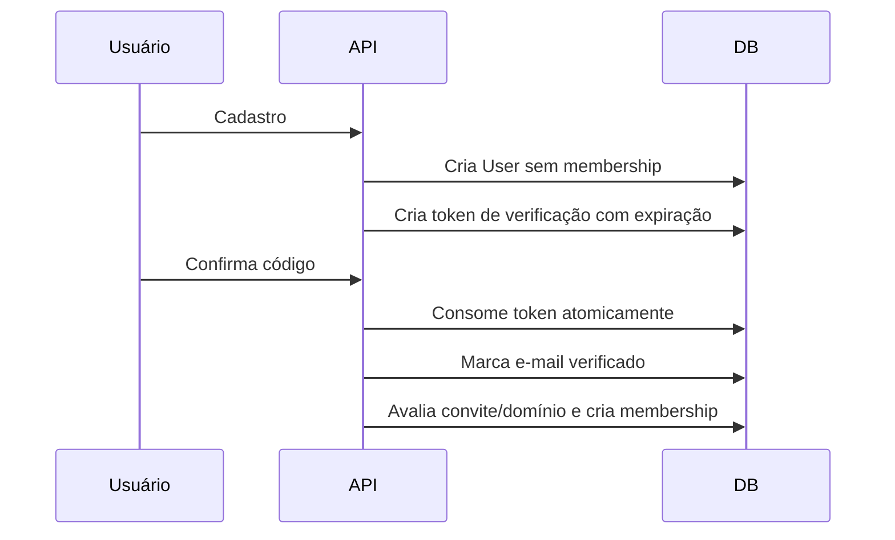

# Fase 1 — Segurança, Autenticação, RBAC e Privacidade

## Objetivo

Corrigir a arquitetura de identidade e autorização antes da entrada de usuários reais. Esta fase substitui os bloqueios conservadores da Fase 0 por políticas definitivas.

## Sequência recomendada

A migração do cookie deve ser coordenada. Torná-lo `HttpOnly` antes de remover chamadas privadas diretas do navegador quebrará upload, paginações e mutações atuais.

1. Criar BFF/Server Actions para chamadas privadas.
2. Remover JWT de props e Client Components.
3. Tornar o cookie `HttpOnly`.
4. Corrigir OAuth e vinculação de contas.
5. Ativar verificação obrigatória de e-mail.
6. Aplicar matriz CASL e DTOs de privacidade.
7. Implementar tokens/sessões revogáveis.

## 1.1 Sessão BFF e cookie seguro

Arquivos principais:

- `apps/web/src/http/api-client.ts`
- `apps/web/src/auth/auth.ts`
- `apps/web/src/app/auth/sign-in/actions.tsx`
- `apps/web/src/app/api/auth/callback/route.ts`
- Client Components que recebem `token`

Cookie alvo:

```ts
cookieStore.set('token', token, {
  httpOnly: true,
  secure: process.env.NODE_ENV === 'production',
  sameSite: 'lax',
  path: '/',
  maxAge: 60 * 60 * 24,
})
```

Checklist:

- [ ] Migrar upload para route handler/BFF ou URL assinada.
- [ ] Migrar chamadas administrativas client-side para Server Actions.
- [ ] Remover leitura com `cookies-next`.
- [ ] Remover `token` do retorno de `auth()`.
- [ ] Remover token de props serializadas em RSC.
- [ ] Reduzir access token para duração curta.
- [ ] Não registrar Authorization headers.

## 1.2 OAuth seguro

Checklist:

- [ ] Gerar `state` criptograficamente aleatório.
- [ ] Persistir continuação em cookie HttpOnly ou store server-side com validade de 10 minutos.
- [ ] Consumir `state` uma única vez no callback.
- [ ] Aceitar apenas caminhos internos iniciados por `/` e rejeitar `//`.
- [ ] Não enviar token de convite, e-mail ou PII ao Google no `state`.
- [ ] Validar `email_verified === true`.
- [ ] Buscar login social primeiro por `(provider, providerAccountId)`.
- [ ] Exigir reautenticação antes de vincular conta OAuth a conta com senha preexistente.
- [ ] Adotar PKCE se suportado pelo fluxo escolhido.

Teste obrigatório:

- Callback sem state, state inválido, expirado ou reutilizado deve falhar.
- `redirectTo=https://externo.example`, `//externo.example` e esquemas não HTTP internos devem ser rejeitados.

## 1.3 Verificação de e-mail antes de membership

Fluxo alvo:



Checklist:

- [ ] Normalizar e-mail para lowercase/trim antes de unicidade.
- [ ] Não criar membership no cadastro.
- [ ] Não excluir convite no cadastro.
- [ ] Bloquear recursos privados para `emailVerifiedAt === null`.
- [ ] Após verificação, consumir convite e criar membership em uma transação.
- [ ] Definir se autoentrada por domínio exige aprovação administrativa.
- [ ] Deduplicar caso convite e domínio apontem ao mesmo clube.

## 1.4 Tokens e revogação de sessão

Mudança de modelo sugerida:

```prisma
model Token {
  id         String    @id @default(uuid())
  digest     String    @unique
  type       TokenType
  expiresAt  DateTime
  consumedAt DateTime?
  createdAt  DateTime  @default(now())
  userId     String

  @@index([userId, type, expiresAt])
}
```

Checklist:

- [ ] Armazenar digest, não bearer token em texto claro.
- [ ] Reset exige `PASSWORD_RECOVER`.
- [ ] Verificação exige `EMAIL_VERIFICATION`.
- [ ] Expiração curta: recuperação 15–30 min; verificação conforme política.
- [ ] Invalidar tokens anteriores quando novo token for emitido.
- [ ] Consumir token atomicamente.
- [ ] Rate limit por token/usuário/IP.
- [ ] Adicionar `sessionVersion` ou tabela de sessões.
- [ ] Revogar sessões após reset, troca de senha e anonimização.

## 1.5 Matriz RBAC única

Evitar CASL combinado com condicionais manuais divergentes. A política deve declarar ações por subject e ser aplicada sobre instância tenant-scoped.

Matriz inicial sugerida:

| Ação | OWNER | ADMIN | MANAGER | COACH | BILLING | ATHLETE | VISITOR |
|---|---:|---:|---:|---:|---:|---:|---:|
| Transferir propriedade | Sim | Não | Não | Não | Não | Não | Não |
| Alterar ADMIN/MANAGER | Sim | Conforme regra | Não | Não | Não | Não | Não |
| Remover membro | Sim | Conforme hierarquia | Não | Não | Não | Não | Não |
| Criar convite ADMIN | Sim | Não/Conforme regra | Não | Não | Não | Não | Não |
| Prescrever treino | Sim | Sim | Sim | Sim | Não | Não | Não |
| Gerir cobrança | Sim | Conforme política | Conforme política | Não | Sim | Não | Não |
| Ler dados internos | Sim | Sim | Sim | Sim | Conforme necessidade | Sim | Não |
| Ler dados médicos | Consentimento/finalidade | Consentimento/finalidade | Não por padrão | Apenas autorizado | Não | Próprio | Não |

Checklist:

- [ ] Remover autorização por proxy, como usar `Invite` para criar `Race`.
- [ ] Distinguir 401 de 403.
- [ ] Criar helpers `requireActiveMembership` e `requireClubAbility`.
- [ ] Nunca converter membership pendente/inativa em acesso interno de visitante.
- [ ] Testar todas as células negativas relevantes da matriz.

## 1.6 DTOs e política de privacidade

DTOs mínimos:

- `PublicClubDto`
- `InternalClubDto`
- `PublicAthleteDto`
- `OwnAthleteDto`
- `CoachAthleteDto`
- `MedicalAthleteDto`
- `PublicWorkoutDto`
- `PrivateWorkoutDto`

Checklist:

- [ ] Perfil público respeita `isPublic`.
- [ ] Treino respeita `PUBLIC`, `PRIVATE`, `COACH_ONLY` no filtro Prisma.
- [ ] E-mail não aparece em perfil público.
- [ ] Data de nascimento completa não aparece em lista de membros.
- [ ] Dados médicos ficam em endpoint separado e auditado.
- [ ] `routeData` só retorna quando a tela precisa do mapa.
- [ ] `passwordHash` e tokens Strava nunca são selecionados por rotas de UI.
- [ ] Definir retenção e exclusão para dados médicos e localização.

## 1.7 Senhas e brute force

Checklist:

- [ ] Política única de senha entre cadastro/reset/update.
- [ ] Preferir Argon2id; se mantiver bcrypt, calibrar custo no hardware da VPS.
- [ ] Mínimo recomendado de comprimento de passphrase, sem máximo excessivamente baixo.
- [ ] Rate limit por IP e identificador normalizado.
- [ ] Backoff progressivo e alertas de abuso.
- [ ] Respostas externas genéricas para reduzir enumeração.
- [ ] `JWT_SECRET` com requisito de entropia e rotação.
- [ ] Definir issuer e audience dos JWTs.

## 1.8 Modernização criptográfica

### Senhas

- [ ] Migrar novos hashes para Argon2id.
- [ ] Calibrar memória/iterações na VPS para aproximadamente 100–250 ms.
- [ ] Manter verificação bcrypt apenas para legado.
- [ ] Rehash oportunista para Argon2id após login bcrypt válido.
- [ ] Aplicar rate limit/backpressure compatível com o custo de memória.

### Tokens

- [ ] Gerar bearer token com `randomBytes(32)`.
- [ ] Armazenar apenas SHA-256 do token de alta entropia.
- [ ] Para OTP curto, usar `randomInt` e HMAC-SHA-256 com pepper.
- [ ] Expiração, tentativas e consumo atômico obrigatórios.

### JWT

- [ ] Atualizar primeiro `@fastify/jwt`/`fast-jwt` para versões corrigidas.
- [ ] Fixar algoritmo, issuer e audience.
- [ ] Validar segredo com no mínimo 32 bytes aleatórios.
- [ ] Implementar key ring/rotação e `kid`.
- [ ] Access token curto e refresh opaco rotativo armazenado como digest.

### Dados em repouso

- [ ] Cifrar `medicalConditions` e futuros tokens Strava reais com AES-256-GCM.
- [ ] Nonce exclusivo por gravação, AAD e `keyVersion`.
- [ ] Chave mestre fora do PostgreSQL.
- [ ] Migração em colunas paralelas com backfill idempotente.
- [ ] Testar rotação e recuperação das chaves.

Detalhes: [Plano de Dependências e Modernização Criptográfica](./PLANO-DEPENDENCIAS-CRIPTOGRAFIA.md).

## Testes de aceite

1. Cadastro com e-mail alheio não concede membership.
2. Conta não verificada não acessa rota privada.
3. Login Google não incorpora silenciosamente conta de senha preexistente.
4. JWT não pode ser lido por `document.cookie`.
5. Token não aparece no payload RSC.
6. Redirect externo ou state adulterado é rejeitado.
7. Token expirado, consumido ou de tipo incorreto não redefine senha.
8. Reset invalida sessões anteriores.
9. Visitante não obtém PII ou treino privado.
10. Todos os testes cross-tenant retornam 403/404 sem alterar dados.

## Critério de saída

A aplicação pode sair de NO-GO apenas quando esta fase e a Fase 0 estiverem concluídas e os testes negativos forem executados no CI.
