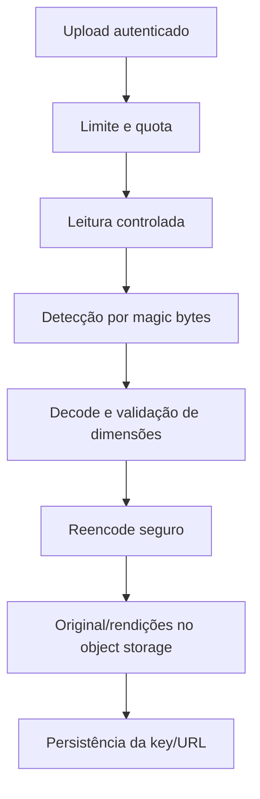
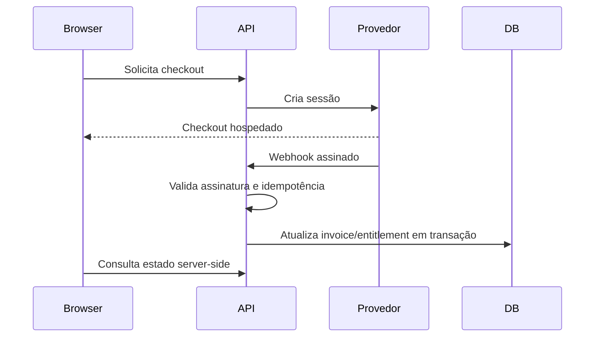

# Fase 4 — Uploads, Imagens, E-mail e Pagamentos

## Objetivo

Substituir implementações locais/simuladas por interfaces seguras e operáveis, sem acoplar domínio a um provedor específico.

## 4.1 Pipeline seguro de imagens

Fluxo recomendado:



Checklist:

- [ ] Validar magic bytes, não só MIME multipart.
- [ ] Decodificar imagem para provar que o conteúdo é válido.
- [ ] Gerar extensão no servidor.
- [ ] Limitar bytes, pixels, largura, altura e quantidade por usuário.
- [ ] Reencodar para remover conteúdo inesperado/metadados desnecessários.
- [ ] Aplicar rotação EXIF antes de remover metadados.
- [ ] Definir política para preservar/remover GPS EXIF; por privacidade, remover por padrão.
- [ ] Armazenar key do objeto, não depender de path local.
- [ ] Implementar remoção de arquivos órfãos.
- [ ] Usar `uploadId` estável/objeto temporário com TTL para retries.
- [ ] Associar upload à entidade em operação explícita e remover temporários não associados.
- [ ] Servir mídia em origin/CDN separado quando possível.

## 4.2 Qualidade visual

O código atual não reduz a qualidade dos bytes; ele salva o original. A baixa qualidade observada provavelmente decorre de arquivo pequeno ampliado ou do uso de `object-cover` sem rendições.

Rendições sugeridas:

| Uso | Dimensão sugerida | Formato/qualidade |
|---|---:|---|
| Avatar | 256×256 e 512×512 | WebP/AVIF 85–90 |
| Card | 640–960 px de largura | WebP/AVIF 82–88 |
| Banner | 1600–2400 px de largura | WebP/AVIF 85–90 |
| Original | Sem enlargement, limite definido | Formato original ou normalizado |

Checklist frontend:

- [ ] Usar `next/image`.
- [ ] Definir `sizes` corretamente.
- [ ] Configurar `remotePatterns` apenas para storage controlado.
- [ ] Evitar ampliar acima da resolução natural.
- [ ] Informar proporção e resolução recomendadas ao usuário.
- [ ] Permitir crop consciente para avatar/banner.
- [ ] Não usar a mesma rendição em todos os contextos.

## 4.3 Object storage

Requisitos do provider:

- durabilidade;
- lifecycle;
- CORS restrito;
- URLs assinadas ou bucket público somente para mídia aprovada;
- limites de custo;
- observabilidade;
- exclusão LGPD;
- ambiente separado para desenvolvimento/produção.

Interface sugerida:

```ts
interface ImageStorage {
  put(input: PutImageInput): Promise<StoredImage>
  delete(key: string): Promise<void>
  getSignedUploadUrl?(input: SignedUploadInput): Promise<SignedUpload>
}
```

## 4.4 E-mail desacoplado do Resend

Como o Resend será removido, criar contrato antes de escolher o substituto:

```ts
interface EmailProvider {
  send(message: EmailMessage): Promise<EmailDeliveryResult>
}
```

A persistência deve usar outbox:

- domínio grava token/convite + outbox na mesma transação;
- worker envia;
- retry com backoff;
- idempotency key;
- dead-letter;
- status e erro redigido;
- nenhum token completo nos logs.

Checklist:

- [ ] Usuário não recebe falso sucesso silencioso sem status rastreável.
- [ ] Falha do provider não invalida atomicidade do banco.
- [ ] Troca de provider não altera handlers de domínio.
- [ ] Templates escapam valores controlados por usuário.
- [ ] Links usam origem de produção validada e HTTPS.

## 4.5 Pagamento real futuro

Não implementar entitlement a partir do retorno do navegador.

Fluxo alvo:



Requisitos:

- [ ] Assinatura do webhook.
- [ ] Idempotency key estável enviada também ao PSP ao criar checkout.
- [ ] `provider + eventId` unique para deduplicar webhooks.
- [ ] Evento duplicado retorna 2xx sem reaplicar cobrança/entitlement.
- [ ] Validação de valor, moeda, customer e entidade local.
- [ ] Máquina de estados de subscription/invoice.
- [ ] Reconciliação periódica.
- [ ] Segredos somente no servidor.
- [ ] Entitlement consultado pela API em toda ação privilegiada.
- [ ] `Decimal` ou centavos para dinheiro.

## Testes de aceite

1. Arquivo HTML/SVG disfarçado de PNG é rejeitado.
2. Imagem excessivamente grande em pixels é rejeitada mesmo abaixo de 5 MB.
3. Quota impede crescimento ilimitado por usuário.
4. Redeploy não remove imagens.
5. Exclusão do usuário remove/agenda remoção de objetos associados.
6. Imagem de baixa resolução não é ampliada silenciosamente.
7. Falha do provider de e-mail entra em retry sem perder o evento.
8. Webhook duplicado não duplica cobrança ou entitlement.
9. Retry de upload não deixa múltiplos arquivos permanentes órfãos.
10. Mesma idempotency key de checkout não cria duas sessões no PSP.

## Critério de saída

Storage local deixa de ser fonte definitiva em produção, imagens possuem pipeline de segurança/qualidade, e-mail usa contrato/outbox e rotas simuladas de pagamento permanecem desabilitadas até a integração real.
