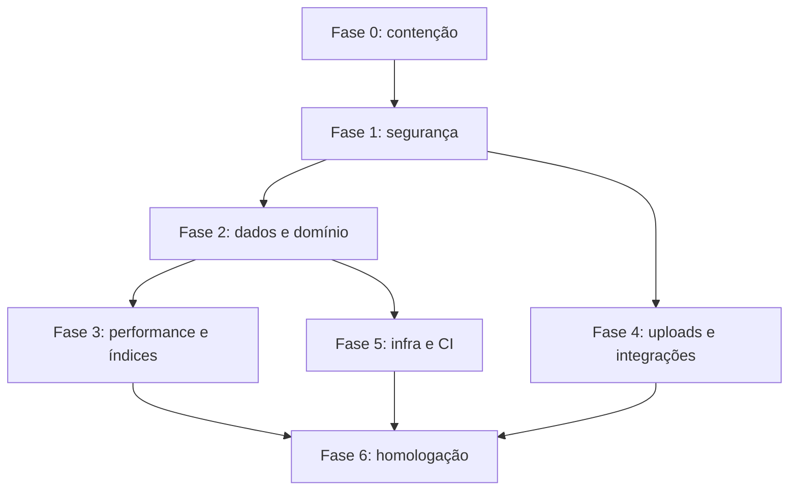

# Roadmap de Correções da Auditoria ClubRun

Este diretório transforma os achados da auditoria em fases implementáveis, com dependências, critérios de aceite e validações.

> Estado atual: **NO-GO para abertura ao público** até a conclusão das fases 0 e 1. Como ainda não existem usuários reais, as mudanças de autenticação e modelo de dados devem ser feitas antes da coleta de dados pessoais.

## Relatórios complementares

- [Auditoria 2 — Contratos, Qualidade e Arquitetura](./AUDITORIA-2-CONTRATOS-QUALIDADE-ARQUITETURA.md)
- [Plano de Dependências e Modernização Criptográfica](./PLANO-DEPENDENCIAS-CRIPTOGRAFIA.md)
- [Auditoria 3 — Idempotência, Retries e Concorrência](./AUDITORIA-3-IDEMPOTENCIA.md)
- [Auditoria 4 — Melhores Práticas React 19 e Next.js 16](./AUDITORIA-4-REACT-NEXT.md)

A segunda auditoria confirmou divergências de contratos frontend/backend e vulnerabilidades de supply chain. O `pnpm audit --prod` reportou 4 ocorrências críticas, 45 altas, 64 moderadas e 7 baixas; os hotfixes de CASL, JWT, Next e Fastify passam a fazer parte da Fase 0.

A auditoria de idempotência confirmou que não existe `Idempotency-Key` ou ID de comando nas mutações atuais. Criação de treino/corrida, efeitos de tênis, transições de ownership/billing e endpoints `toggle` precisam de mecanismos específicos antes de retries automáticos.

A auditoria React/Next identificou uma violação crítica das Rules of Hooks, corridas em effects assíncronos, timers sem cleanup, ausência de loading/error/not-found boundaries, Client Components excessivamente amplos e problemas de acessibilidade/bundle.

## Ordem de execução

| Ordem | Documento | Objetivo | Gate de saída |
|---|---|---|---|
| 0 | [Fase 0 — Contenção e Hotfix](./FASE-0-CONTENCAO-HOTFIX.md) | Eliminar riscos imediatamente exploráveis na VPS | Credencial rotacionada, simulações bloqueadas, backup validado e acessos cross-tenant fechados |
| 1 | [Fase 1 — Segurança, Autenticação e Privacidade](./FASE-1-SEGURANCA-AUTH-PRIVACIDADE.md) | Corrigir identidade, sessão, OAuth, CASL, tenant scope e DTOs | Matriz RBAC e testes negativos passando; JWT indisponível ao JavaScript |
| 2 | [Fase 2 — Consistência de Dados e Domínio](./FASE-2-CONSISTENCIA-DADOS-DOMINIO.md) | Tornar mutações atômicas e reparar invariantes/migrações | Treino/ranking/tênis transacionais e migrações ensaiadas em cópia do banco |
| 3 | [Fase 3 — Performance, Queries e Índices](./FASE-3-PERFORMANCE-QUERIES-INDICES.md) | Remover N+1/overfetch e aplicar índices sustentados por planos reais | Baseline e pós-mudança documentados com `EXPLAIN`/`pg_stat_statements` |
| 4 | [Fase 4 — Uploads e Integrações](./FASE-4-UPLOADS-INTEGRACOES.md) | Endurecer storage, melhorar imagens e preparar e-mail/pagamento reais | Upload validado por conteúdo, lifecycle definido e integrações desacopladas |
| 5 | [Fase 5 — Infraestrutura, CI e Observabilidade](./FASE-5-INFRA-CI-OBSERVABILIDADE.md) | Criar gates reais de deploy e operação segura | Lint/typecheck/test/build/migrate/smoke test bloqueando regressões |
| 6 | [Fase 6 — Homologação e Go-live](./FASE-6-HOMOLOGACAO-GO-LIVE.md) | Validar segurança, carga, recuperação e checklist de lançamento | Critérios de go-live integralmente aprovados |

## Dependências principais

A Fase 3 começa formalmente após as correções estruturais da Fase 2, pois alterações de ranking, tokens e consultas mudam quais índices são realmente necessários. A coleta de baseline pode começar antes.

## Regras para todas as fases

1. Não corrigir migrações já aplicadas reescrevendo silenciosamente o histórico. Criar migração forward-only e documentar o estado dos ambientes.
2. Fazer backup e testar restauração antes de qualquer alteração destrutiva.
3. Toda autorização deve ser validada na API usando identidade da sessão e tenant do recurso; a UI nunca é a autoridade.
4. Toda rota de leitura deve retornar DTO explícito, não modelos Prisma completos.
5. Toda mutação multi-entidade deve definir atomicidade, idempotência e comportamento em concorrência.
6. Não usar IDs, UUIDs, slugs ou URLs difíceis de adivinhar como controle de acesso.
7. Adicionar testes negativos junto com cada correção: outro tenant, papel insuficiente, estado inválido e payload malformado.
8. Medir performance antes e depois; índices sem plano de consulta e cardinalidade podem aumentar escrita sem benefício.

## Definition of Done global

Uma fase só está concluída quando:

- Código, schema, migrações, testes e documentação foram atualizados.
- Testes positivos e negativos passaram.
- `lint`, `tsc --noEmit`, testes e build passaram no CI.
- Migração foi ensaiada em cópia representativa do banco.
- Estratégia de rollback ou correção forward foi registrada.
- Nenhum segredo, upload ou dado pessoal foi adicionado ao Git.
- Logs novos não contêm senha, token, e-mail completo, dado médico ou GeoJSON.

## Achados por fase

| Fase | Achados principais |
|---|---|
| 0 | CR-01, CR-03, CR-04, AL-07, AL-04 |
| 1 | CR-02, CR-03, CR-04, CR-05, CR-06, AL-01, AL-05 |
| 2 | CR-07, AL-02, AL-03, AL-06, AL-08, ME-08, ME-09 |
| 3 | ME-02, ME-03, ME-04 |
| 4 | AL-04, AL-07, BA-01, ME-07 |
| 5 | ME-05, ME-06, ME-07, BA-02 |
| 6 | Revalidação de todos os achados |

## Validações já conhecidas

- Testes unitários da API: 83/83 passando.
- Lint: falha com 180 erros e 644 avisos.
- `pnpm check-types`: não executa nenhuma tarefa atualmente.
- `tsc --noEmit` da API: falha com erros de tipos/CASL/aliases.
- `tsc --noEmit` do web: passa.
- Testes E2E não foram executados durante a auditoria porque criam e removem bancos PostgreSQL.
- `pnpm outdated -r`: executado; há atualizações patches/minors e majors a separar em lotes.
- `pnpm audit --prod`: 120 ocorrências reportadas — 4 críticas, 45 altas, 64 moderadas e 7 baixas.
- Código de produção: 46 declarações `any`, 42 casts `as any`, 16 `z.any()`, quatro catches vazios e uma suppressão TypeScript.
